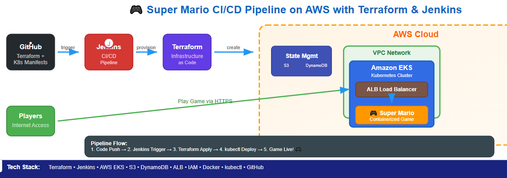

# 🎮 Super Mario App CI/CD on AWS with Terraform, Jenkins, EKS

This project demonstrates a complete DevOps pipeline to deploy a containerized **Super Mario game application** on AWS using **Terraform, EKS, Jenkins, GitHub, S3, and DynamoDB** — all configured using **Infrastructure as Code (IaC)** and built within the **AWS Free Tier** where possible.

---
## 📌 Project Overview  

### 🔹 Infrastructure Provisioning with Terraform  
- Creates **VPC, subnets, IAM roles, EKS cluster, and worker node groups**.  
- Stores Terraform state in **S3 with DynamoDB for state locking**.  

### 🔹 CI/CD with Jenkins  
- Automates **Terraform validation, planning, and applying**.  
- Builds & deploys **Kubernetes manifests (Deployment + Service)**.  
- Automates **rollouts and cleanup workflows**.  

### 🔹 Application Deployment  
- Deploys the **Super Mario containerized application**.  
- Exposes the game via **Kubernetes LoadBalancer**.

---

## 🧰 Tools & Technologies Used

| Tool         | Purpose                                                                 |
|--------------|-------------------------------------------------------------------------|
| Terraform    | Provision AWS infrastructure (EKS cluster, VPC, IAM, S3, DynamoDB, etc.)|
| AWS EKS      | Kubernetes cluster to run and manage Dockerized app                    |
| Jenkins      | CI/CD server to automate provisioning and deployment                   |
| GitHub       | Source code repository and Jenkins pipeline trigger                    |
| Docker       | Containerization of the Super Mario app                                |
| kubectl      | Kubernetes CLI tool to manage deployments                              |
| AWS S3       | Stores Terraform state file for collaboration and persistence          |
| DynamoDB     | Locks Terraform state to prevent concurrent updates                    |
| ALB          | LoadBalancer for public access to the deployed application             |
| IAM Roles    | Secure access between Jenkins, EKS, and EC2                            |


---

## 📦 Project Structure

```
super-mario-eks/
├── .github/              # (Optional GitHub Actions, if any)
├── kubernetes/
│   ├── deployment.yaml   # Defines app deployment to EKS
│   └── service.yaml      # Exposes app via LoadBalancer
├── terraform/
│   ├── main.tf           # Main infra logic (EKS, IAM, etc.)
│   ├── variables.tf      # Input variables
│   ├── backend.tf        # S3 + DynamoDB configuration
|   ├── outputs.tf        # outputs used 
|   └── provider.tf        # required providers as aws and kubernetes
├── jenkins/              
│   └── Jenkinsfile       # CI/CD pipeline definition
├── README.md             # Project documentation
```

---

## 🚀 CI/CD Pipeline Flow (Defined in Jenkinsfile)

### Init Terraform
- Jenkins initializes Terraform in the `terraform/` directory
- Uses `aws-creds` from Jenkins credentials store

### Provision Infrastructure
- Terraform provisions:
  - EKS Cluster
  - Node Group (EC2 instances)
  - IAM roles
  - VPC/Subnets/Security Groups
  - S3 backend for state file
  - DynamoDB for locking

### Configure kubectl
- Jenkins sets up `kubectl` using `aws eks update-kubeconfig`

### Deploy App to Kubernetes
- Jenkins applies:
  - `kubernetes/deployment.yaml` → Deploys Dockerized Super Mario
  - `kubernetes/service.yaml` → Creates a LoadBalancer


---

## 💾 Terraform State Management

To avoid conflicts and ensure collaboration safety:

| Resource     | Purpose                                  |
|--------------|-------------------------------------------|
| S3 Bucket    | Stores `.tfstate` file (current infra)    |
| DynamoDB     | Locks the state file during operations    |

Defined in `terraform/backend.tf`

---


## 🏗️ Architecture  


 

---

## 🔄 CI/CD Pipeline Workflow  

1. **Code Commit** → Developer pushes Terraform/Kubernetes changes.  
2. **Jenkins Trigger** → Pipeline starts automatically.  
3. **Terraform Stage** → Validate, plan, and apply AWS infrastructure.  
4. **Kubernetes Stage** → Apply deployment and service manifests.  
5. **Deployment Complete** → Super Mario app is live via LoadBalancer.  

---

## ⚙️ Setup Instructions  

### 1. Prerequisites  
- AWS account with IAM permissions.  
- Jenkins installed (on EC2 or server).  
- Terraform installed (>= 1.2).  
- kubectl installed.  
- S3 bucket + DynamoDB table for remote Terraform state.  

### 2. Configure AWS Credentials  
Set the following in **Jenkins credentials** or environment variables:  
- `AWS_ACCESS_KEY_ID`  
- `AWS_SECRET_ACCESS_KEY`  
- `AWS_DEFAULT_REGION`  

### 3. Run Jenkins Pipeline  
- Commit your Terraform & Kubernetes code.  
- Run the Jenkins job → It will:  
  - Provision AWS infra with Terraform.  
  - Deploy Super Mario app to EKS.  

### 4. Access the Application  
- Get the LoadBalancer DNS:  
  ```bash
  kubectl get svc mario-service

## ✅ Conclusion & Final Outcome

This setup provides an automated workflow for managing your EKS infrastructure and application deployments using Terraform and Jenkins CI/CD. It improves consistency, reduces manual errors, and integrates infrastructure changes directly into your version control and CI/CD processes.

- Jenkins automates **end-to-end provisioning and deployment**
- Your app is **live on the internet** behind a secure LoadBalancer
- Code, infrastructure, and deployment are **fully automated and repeatable**


---

## THANK YOU!


